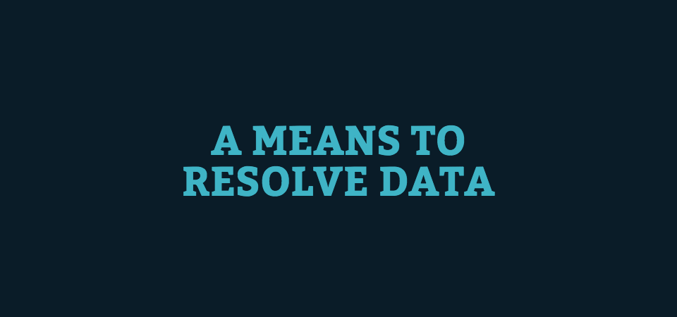
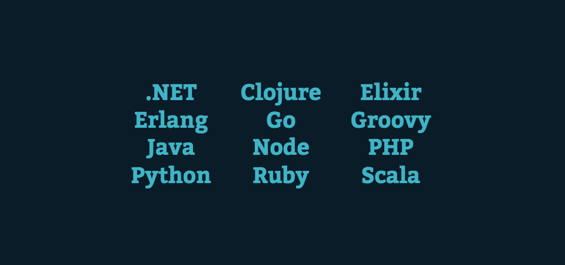

Hello! My name is Dustin Schau and I hope to share some knowledge with you about... you guessed it, GraphQL!

I intend for this to be a gentle introduction to foundational concepts of GraphQL. In illustrating these concepts, we gain a greater understanding of what makes GraphQL such a transformative technology, and a greater appreciation for the value it can provide for an application. I go into some detail of the problems that GraphQL is trying to solve and how it solves them.

I'll end with a section on integration into an existing backend. This is primarily focused on an existing RESTful backend, but can be substituted to any data storage mechanism, e.g. MySQL, Mongo, etc. I'll have a number of code examples and repos at the end so you can dive further into some real code powered by both server and client-side GraphQL technologies. Let's do it!


I'm a frontend developer who likes to claim that I specialize in all things JavaScript. The last few months, the client work I've been doing has had a NodeJS focus, so that ties in particularly well for a deep dive into GraphQL.

I work for an awesome company called Object Partners. We have offices in Minneapolis and Omaha, and about 100 senior developers between both offices.


Lately, I think there's been a tendency to follow what is essentially Facebook Driven Development. With React, GraphQL, Jest, and other Facebook open source initiatives eating the world, it sometimes feels that if you're _not_ using this new hotness you're falling behind. With this perception comes a perhaps deserved backlash and mistrust of some of these technologies.

> _I_ don't need React; jQuery|Vue|Insert framework here works fine for me thank you very much

> Jest? Nah, Mocha and Karma are all I'll ever need.

I'd like you to resist succumbing to this mindset, and rather approach GraphQL with an eager and open mind. Whether React is in your wheel house or company's stack or not, I still strongly feel that GraphQL is a transformative technology for data querying and how we communicate between client and server, so try to resist those notions to reject GraphQL simply _just_ because it's new, hot, and from Facebook.


Many have called GraphQL a REST killer because the functionality it offers seems to be a game-changer for how we consider backend development and the relationship between client and server. What can we make of this? Is GraphQL actually a REST killer?


**No.** I do not personally believe GraphQL to be the REST killer as some have claimed.

It seems slightly contradictory for a technology that some have purported to _kill_ REST to actually make REST better, and that is one of the key points I want you to take home. Implementing GraphQL today will make your REST backend more easily queryable, better documented, and can even improve performance client-side by reducing round-robin requests among many other benfits.


In effect, I am absolutely not claiming that GraphQL kills REST. It is, in fact, intended to be a gentle introduction to GraphQL and how to begin implementing GraphQL in your RESTful backend, today. I believe that implementing GraphQL will lead to a number of tangible benefits and overall will improve your backend service communication between client and server.


Before we begin the section on integration, it is, of course, helpful to first take a step back and describe GraphQL at a foundational level. I will construct the base, disparate pieces that make up GraphQL and how they contribute to the larger whole of the value and benefit of GraphQL.


GraphQL is perhaps at its most interesting and valuable, a query language. Using a JSON like structure--which we'll see in more detail in a bit--we can pluck only the fields we need for our UI. Doing so results in a more performant and cleaner interface between client and server, and it is this query language that is one of the largest benefits as I see it with GraphQL.


To begin describing this query language, first consider this `User` inteface. Pretend we have a RESTful backend that operates on this User resource, and this RESTful backend has a number of CRUD operations that operate on this resource.


With GraphQL we can request a _subset_ (or every field!) using this query language. This query language directly maps to our underlying data interface/contract, and so we can pull _only_ what we need and no more. If our requirements for our UI change at some point in the future, we can simply request either less or more data depending on our needs.


Let's say down the road we _only_ need to display a user's name, and we'd like to alias that property in our query to `username`. Incredibly simple with GraphQL, and we didn't have to make a single backend change to accomodate this functionality.


It's clear that one of the strongest benefits of GraphQL is, in fact, this query language. The structure of the data is described in the query itself, and the resulting data set matches this requested structure.

However... you may be jumping ahead of me here. What we've described can be _easily_ implemented with REST, utilizing query parameters which will conditionally filter and return only what is requested. There are tools to make this easier, such as [Apache Solr][solr].

[solr]: http://lucene.apache.org/solr/


I would agree with you that if this simple example encapsulated the depth of the value of GraphQL queries that the benefit may not be there for you. The REST example with query parameters is really _not that bad_ and I'd be comfortable adopting that in my client-side application.


But wait... as you may have guessed it, we've only scratched the surface of what is possible with GraphQL. Now let's consider a more complex example which is not as easily achieved with a traditional RESTful backend.


The beauty of GraphQL queries is that they accomodate deeply nested data just as simply as if we were plucking data from a top-level resource. If you only want _some_ properties of a deeply nested resource, it couldn't be simpler to pluck only what you need for the UI and no more, thereby sending less data from the server and rendering only what you need in the UI.


How would this be done in REST? I'm _sure_ there are solutions and libraries to achieve this--and please let me know if you know of any particularly good ones--but utilizing a tool that makes it simple and has a defined, easily understood query language makes this a strong selling point of adopting GraphQL.


Up to this point, the query language is the R in CRUD. How is the CUD handled with GraphQL? You better believe there's a solution for that too!


The GraphQL solution to the CUD is via a concept called mutations. Mutations allow you to update a resource (be it create, update, or delete) and optionally use that same query language to pluck queried data from the created/updated/deleted resource.


Here's a sample mutation that is creating a review. A review takes some input, which is an episode and then a review, each of which is typed at the GraphQL server level, and validation on this input will happen "for free" with the GraphQL type system.

When run, this mutation will create a review and we will grab the stars and commentary so we can display it in the UI. Incredibly easy and intuitive!


That type system we just used for a mutation? It's also a foundational concept in GraphQL. By leveraging this strong type system, our backend enables excellent documentation, validation, and even autocomplete/intellisense quite easily. Let's dive in to this type system.


Remember that earlier interface for a user? Here's how that same user is represented with GraphQL's type system. Let me make note of a few concepts that may need clarification:

1. The `!` means that a field is non-nullable. In other words, a User will always contain a field of id and it will be type ID
2. The `ID` type is a special type in GraphQL, and using it enables some nice functionality like improved caching, unique resource recognition, etc.

Note: I am using the library [graphql-tools][graphql-tools] from [Apollo](https://www.apollographql.com/) to leverage this string type system. You can also use the reference implementation [graphqljs][graphqljs], but it tends to be a bit more verbose.

[graphql-tools]: https://github.com/apollographql/graphql-tools
[graphqljs]: https://github.com/graphql/graphql-js


A schema essentially describes our entire data model. A schema is composed of queries and mutations which augment and/or return resources which are mapped to resource types (like the above user).

As the schema is strongly typed, as mentioned we can get some great functionality very easily like excellent documentation, validation, etc. We'll go into more depth on this in a bit.


An incredibly simple schema is shown here. We have our familiar `User` type, and now we've introduced a Query. Our `users` query accepts a non-nullable limit argument and returns an Array of non-nullable User resources.

In just several lines of code, we've created a strongly typed representation of our data model that can be queried against and used by a client. Once-more, this is utilizing the library [graphql-tools][graphql-tools] from [Apollo](https://www.apollographql.com/).

[graphql-tools]: https://github.com/apollographql/graphql-tools


GraphQL's query language is powered by a core technique known as resolvers. _Every_ field you request can have custom resolvers, and even deeply nested requests can be easily and cleanly resolved with this technique.

Resolvers are the foundational technique that enable the heart of GraphQL's functionality. Resolvers allow you to specify how query fields are resolved--as you'd expect! This means that whatever mechanism you use to store data (i.e. MySQL, RESTful backend, MongoDB, etc.) can be used to request resources from that data store and return it to the client, on demand. If a field isn't requested in a query, the field is never resolved and an additional request is not made!

Additionally, resolvers can be defined for _any_ field, or even to add additional functionality to a resource (e.g. a computed property on User which adds fullName).



If we consider our sample RESTful backend again, we can now implement this data fetching cleanly and simply with resolvers. When we query for resources, we specify how to resolve these resources by hitting out RESTful backend and returning the necessary data. GraphQL will handle only sending the payload requested to the user as long as we return the subset of non-nullable fields and typed fields appropriately. Excellent!


Let's go into a bit more depth on resolvers.

Each resolver is a function that can return sync or async a value corresponding to the non-nullable fields specified for that resource.

Additionally, each resolver function is injected with three arguments:

## root

The root is effectively the "parent" of the current resolved field. For instance, when we resolve a user's manager, root refers to the already resolved user. This makes it easy to use resolved fields (i.e. a user's id) to make a second request to get additional resolved data.

## args

args is simply an object representing our passed arguments/options to the resource type. For instance, if we pass a limit to the users query, it will be expressed as:

```json
{
  "limit": 10
}
```

and can be easily accessed with this args argument.

## context

Finally, context is how shared data, e.g. authentication, shared database connection, etc. can be made available to _any_ resolver cleanly.


Let's wire this all up and show how to create a schema, once again utilizing [graphql-tools][graphql-tools]

[graphql-tools]: https://github.com/apollographql/graphql-tools


First, we import `makeExecutableSchema` which will wire up a schema given typeDefs (our schema and type definitions), and resolvers, which resolve data appropriately.

This schema is then typically passed to whatever type of server you're working with. There exists a number of options, e.g.

- [express-graphql][graphql-express-middleware]
- [koa-graphql][koa-graphql]
- [apollo-server][apollo-server]

[graphql-express-middleware]: https://github.com/graphql/express-graphql
[koa-graphql]: https://github.com/chentsulin/koa-graphql
[apollo-server]: https://github.com/apollographql/apollo-server


How incredible is this? In approximately 100 or so lines of code, we've created a strongly-typed GraphQL layer to our existing RESTful backend and wired it all up. Could not have been easier!


GraphQL is backend agnostic. As a well-documented technology, it contains a number of reference implementations in effectively whatever your backend language/framework of choice is, although I will mention that NodeJS probably has the most active ecosystem currently.


If your team is a Groovy shop, a .Net shop, whatever, feel free to use what you know and love and there is probably a GraphQL reference implementation for your language of choice.

Check out all the [implementations here](https://graphql.org/code/).



By going through the foundational concepts of GraphQL, some of the problems it is attempting to fix are made extremely apparent. That said, it never hurts to go into a bit more detail and be explicit about the high-level goals of GraphQL and how it attempts to solve some very real API problems many of us have run into over our careers.


[John Resig](https://twitter.com/jeresig?lang=en) mentions here a crucial benefit of GraphQL. If you've perhaps made a mistake, and your database layer may be fairly hard to query against or update resources, GraphQL can be used as a shim layer to abstract some of this complexity while introducing reasonable, understandable queries for your client/users.


That strong type system? It's leveraged to create excellent documentation. Queries expected arguments, argument types, return types, etc. can all be inspected utilizing the excellent tooling and ecosystem around GraphQL.


Of particular note is [GraphiQL](https://github.com/graphql/graphiql), which is distributed as a "middleware" and can be hosted along side your API to give a sort of IDE-like experience to your GraphQL API.

Your entire schema can be inspected and drilled down into. You can even send real queries/mutations/etc. against the real database, and errors or any type mismatches will be displayed inline within the hosted GraphiQL application.

Also worth mentioning is [GraphQLPlayground](https://github.com/prismagraphql/graphql-playground), which also offers similar functionality to GraphiQL.


Let's use a simple example: Twitter. I'm browsing Twitter the other day, scrolling through my feed, and I scroll, scroll, scroll some more, and then finally click on a provocative tweet.

(For the purposes of this example, pretend Twitter's API works as I describe)


I click on a tweet, and clicking this tweet loads additional data and makes additional HTTP requests.


Scrolling down further makes additional HTTP requests. Likes, retweets, author avatar, etc. So in effect, we've introduced a number of REST calls where each interaction could potentially trigger one or more additional REST calls.


This simple interaction of scrolling through and clicking on a tweet could have theoretically created at least 3 API calls. One to request the timeline, one to request detail on a tweet in the timeline, and then finally the conversation for that tweet in the timeline.


We've effectively introduced waterfall requests in our UI. Structured cleanly, this complexity is maintainable, but it's certainly not an easy problem to solve.

Why not use something we're now familiar with... resolvers, and hydrate our client with the minimal data payload they need, thereby reducing waterfall requests and requesting just the minimum subset of data we need for our client.


Let's abstract this a bit, and consider the same functionality but from a GraphQL context.

We can use resolvers to request the first fifty tweets for a user's timeline. Additionally, we can reduce waterfall requests by hydrating each tweet in the timeline with the first couple of items in the conversation.

We can do all of this while maintaining the ability to _easily_ augment what we need for particular views by requesting more or less data fields to build out _exactly_ what we need. The power of GraphQL in one slide.


Let's revisit the question I posited from the beginning. Is it a REST killer?


Again, I say no. It's a REST enhancer. Putting a GraphQL layer in front of your existing backend is one of the best things you can do to improve not only the client-side experience, but also the documentation and validation of your existing API with GraphQL's type system.

However, I will mention that if you're experiencing some latency or otherwise slow connections, it may make sense at some point to rip out the REST layer and directly connect to the data store within GraphQL with resolvers, but I'd urge you here to not prematurely optimize. If you have a backend that works for you, I think introducing GraphQL into your stack is certainly an excellent choice that will have great benefits in the future.


If you were to integrate GraphQL into your stack today, I would have some simple recommendations.


Quite simply, start by introducing GraphQL as a layer in front of your existing API/backend. Keep your backend as is, but tie into the very tangible benefits of GraphQL using the resolvers approach I've shown earlier.


Additionally, by keeping your RESTful backend intact, you keep your business logic intact. No need to rip that out and re-write it within GraphQL resolvers!


Introducing GraphQL absolutely does not, and I'd argue _should not_, constitute an entire re-write of your backend application. It may make sense to do that in the future, but introducing GraphQL gradually--i.e. just one or two APIs here and there--can still have some nice benefits and begin to introduce the value of GraphQL to your users/clients.


Utilize the existing service offerings, be it open source or otherwise. There are some big hitters in this space that can certainly save you some work, and [Apollo](https://www.apollographql.com/) is certainly one of the most prominent players in this space. Investigate their service offerings yourself and see if it makes financial sense to tie into some of their excellent services that enhance GraphQL and make it easier to adopt!


[Graphcool](https://www.graph.cool/) is also an excellent service, and offers some of the same service offerings of [Apollo](https://www.apollographql.com/). I haven't used it as much, but I have heard excellent things, so be sure to do some due diligence to see if either meet your needs more effectively.


If introducing a GraphQL layer to an existing RESTful backend, consider hosting a separate/standalone endpoint to your backend exposed at `/graphql`. This makes it clear it's a separate construct to your base API, but also makes it very clear of the intended purpose.

Additionally, consider hosting something like GraphiQL or GraphQLPlayground to make the interaction and documentation of this new layer as robust as possible!


Up to this point, I've primarily focused on backend technologies, but there are also a great number of niceties that have begun to spring up to make using a GraphQL API as clean as possible in your client side code.


First and foremost, [Apollo](https://www.apollographql.com/) has some excellent open-source client-side offerings.


In particular, I'd like to mention [apollo-boost][apollo-boost], which makes integrating GraphQL in your React application incredibly, incredibly easy.

[apollo-boost]: https://github.com/apollographql/apollo-client/tree/master/packages/apollo-boost


[Graphcool](https://www.graph.cool/) also has a number of client-side libraries, but once again, I haven't investigated them as much. That said, it's still worth comparing side-by-side with [Apollo](https://www.apollographql.com/) to see what fits your needs better!


If you haven't noticed a trend yet, you may not have been paying close enough attention :) [Apollo](https://www.apollographql.com/) and [Graphcool](https://www.graph.cool/) are two of the big players in this space, and you can bet that if you're running into a problem there is likely a service or open-source offering from one of these two companies, if not from Facebook.


Would you consider yourself a minimalist? Is shipping that ultra-small 200KB gzipped JavaScript payload one of your priorities?

If so, you may consider going "vanilla" and utilizing the Fetch API, which can also be used with GraphQL. You won't get some niceties (such as in apollo-boost) that are in my opinion very worth it, but you do ship a reduced payload to your users and that can be an inherently good thing. Just be aware that you may end up implementing more code than you think to deliver similar functionality.


Finally, [urql from FormidableLabs](https://github.com/FormidableLabs/urql) is a newer offering that shows some promise. It is circling much the same space as apollo-boost and intends to make getting started with GraphQL--from a client-side perspective--as simple as possible.

It's a great time to be in the GraphQL ecosystem with all this excellent tooling. Exciting times!


I've created (and open sourced!) some demos and repositories to illustrate some of what I've been discussing today.


Check out some of the below demos/source code to learn more!

## [graphql-rest-implementation](https://github.com/DSchau/graphql-rest-implementation)

A demonstration of graphql-tools and GraphQL as a layer in front of an existing RESTful backend.

## [graphql-rest-demo](https://github.com/DSchau/graphql-rest-demo)

A simple RESTful backend that exposes a CRUD API for operating on a blog-like application, e.g. posts, commments, users, etc.

## [speaker-signup](https://github.com/dschau/speaker-signup)

A client-side application demonstrating apollo-boost and static generation with Gatsby for reduced payload sizes. It uses Github's GraphQL API to display a number of issues, which can then be reacted upon (i.e. liked, disliked, etc.), and is intended to be used to support our local Omaha NebraskaJS meetup.

All have been open sourced, so be sure to check out the code to learn more!


Check out some of these links to view the repos and/or live demonstration sites of the GraphQL functionality!

- [REST backend](https://github.com/DSchau/graphql-rest-demo)
- [GraphQL Layer](https://github.com/DSchau/graphql-rest-implementation)
- [Speaker Signup Repo](https://github.com/DSchau/speaker-signup)
- [Speaker Signup App](https://speaker-signup.netlify.com)


Thanks for reading, and I hope this leaves you feeling much more confident about the value of GraphQL and informed enough to make a decision as to whether it may make sense to adopt for your applications in the future!


