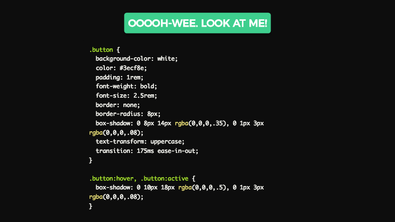
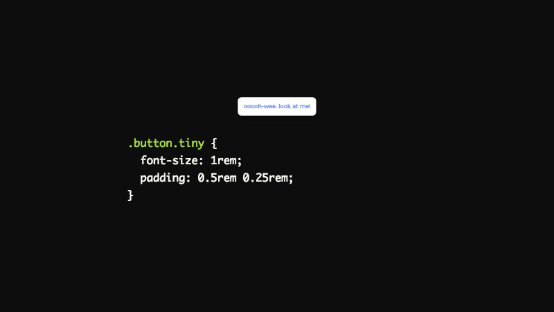
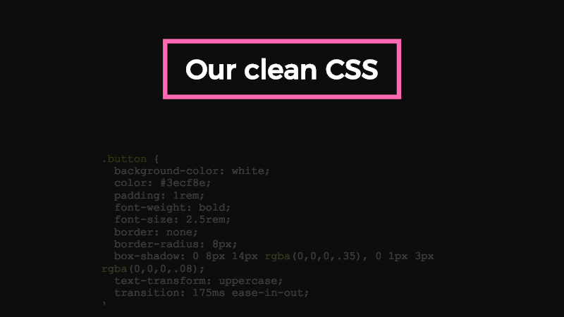
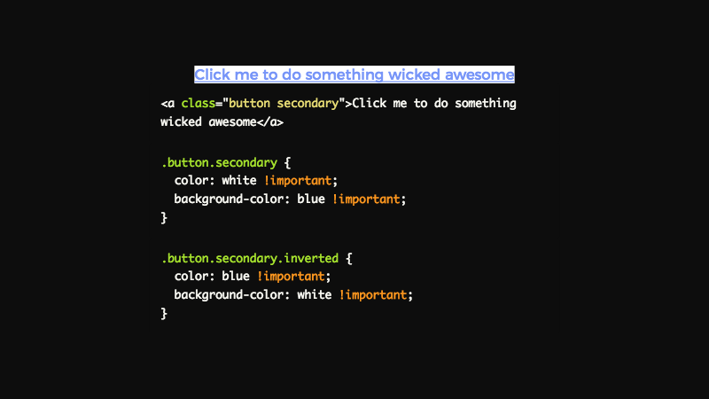
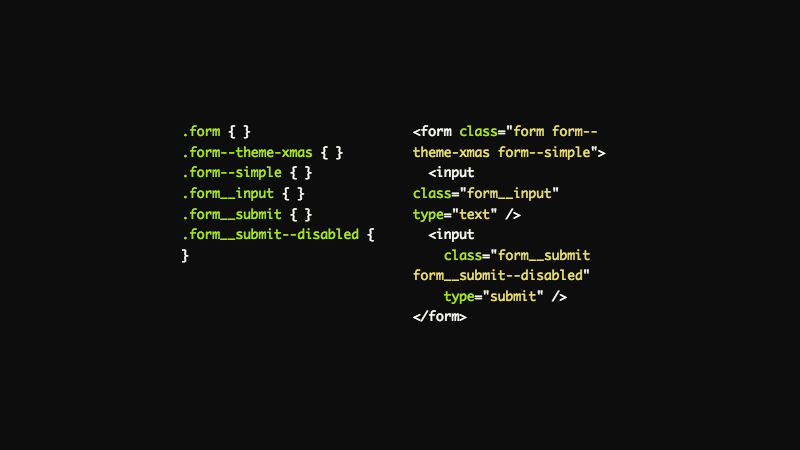

My name is Dustin Schau, and I'm going to hopefully teach you all about CSS in JS today. We'll start with some drawbacks of CSS that led to the creation of these libraries, then discuss advantages of CSS in JS over CSS, shift to discussion of some common patterns, utilities, and libraries to instrument CSS in JS, and then finally end with an illustration of the drawbacks of CSS in JS. Let's get started!
  

I'm a frontend developer speciailizing in all things JavaScript. Throughout my career, I've done a fair bit of everything: Angular, React, jQuery, you name it. Of course, I've also done a fair bit of everything in CSS land, whether it's vanilla CSS, LESS, SASS, CSS Modules, and (of course) the gamut of CSS in JS solutions. I'm from little ol' Omaha, Nebraska, which I think most people looks a bit like this.
  

But... here's what Omaha actually looks like. It's been a great city for me to hone my craft, and I think it's a great technology city for professionals young and old.
    

Every presentation has this prerequisite sponsors slide, but they truly deserve so much credit. Without their support, we wouldn't have all gotten together for this great conference, so it is _sincerely_ appreciated. Thank you so much!
  

I work at a great company called Object Partners. Specialize in JVM and frontend development of all sorts. Between Omaha, Minneapolis, and Chicago, we have about 100 consultants. Come talk to me after if you'd like to learn more--and I'll have some swag to give out to.
  

I feel like some of you _may_ have a pretty negative perception of CSS in JS, or at least not an overtly positive perception. This can be for a variety of reasons, but I thik paramount in some people's minds is that it goes against the "separation of concerns" that have been ingrained in our minds and regularly re-enforced. It can feel weird, it can feel unclean, and it may even feel like a solution looking for a problem.
  

My goal is to take you from this initial possibly negative stance to an understanding of why CSS in JS exists, and how it can solve some some very real developmental problems.  I'm I'm successful, maybe even several of you will leave and want to use/experiment with some of these technologies 😍

## Agenda

- Discussion of the problems of CSS
- Defining what CSS in JS is, and how it can solve some of these problems
- Discussing some various CSS in JS libraries, any real world examples of usage of these
- Finishing up with some discussion of drawbacks of CSS in JS and some quick demos
  

Let's start with a brief discussion of some of the problems of CSS. I will attempt to construct real-world examples, problems that not only I've faced, but I think many developers have experienced whether or not they're aware they have been facing these issues. In illustrating these problems, the foundational basis for the creation of these CSS in JS techniques will be made apparent.

I also want to note that I've attempted to focus these problems on real-world applications, not necessarily problems oftentimes described "at scale." It's so valuable to consider that perspective if you're devoloping those kind of applications, but by narrowing the scope we can more clearly define the problem in more approachable terms and concepts.
  

We get a requirement from our UX team to design a button component that will be used throughout our application suite. This button looks great, meets every current need we have, and the code is quite succinct, to boot. This is great!
  

Our UX team makes another request of our team. We now need a secondary style, and the previous button will be considered the primary style. So&hellip; we add this secondary class, we complete the objective, and we're feeling fairly good about our button component.
  

We get another request that the button is far too large for certain applications, and the request has been made that we add a button with reduced padding, font-size, etc. We add this \`tiny\` class, and we complete the business requirements. This is fine&hellip;
  

We get a final request that the button neds to a have a hover state for accessibility and more intuitive feedback on desktop screens. We add this class, and our button is completed, for now. This is _not_ fine 😫
  

Our clean, pristine button component and CSS are no longer so clean. Each of these simple requests stack and increase the complexity of the component. In effect, we've introduced a number of CSS globals. As anyone is aware, globals are a common enemy of any codebase, and the introduction of globals will make this CSS harder to maintain and use. This is especially evident if designing something like a component library, where hundreds of other developers will use this button, extend upon it, and introduce their own globals. It's incredibly easy to imagine a scenario where collision occurs and this practice makes this approach untenable.
  

But wait&hellip; we've invented techniques to solve these problems!
  

CSS naming methodologies like BEM exist to solve this exact problem re: name collision and CSS globals. Also consider other solutions like Atomic CSS, SMACSS, Object-oriented CSS, etc.
  

Consider this quote by Kent C. Dodds. Why would we not use tooling to automate trivial naming concerns? Development is oftentimes all about automating hard problems, ans is naming not one of the most (unecessarily) difficult ones we face?
  

But others will note that this problem of globals has been solved with tooling in other areas. CSS Modules and Shadow DOM (a staged spec introduced in web components to isolate styling to a particular subset of the DOM) _both_ are intended to solve this problem.

CSS Modules is an implement of CSS in JS, so if you leave here with nothing else, consider integrating CSS Modules support into your application. It'll generate a unique hash based on a user supplied class name. Shadow modules are similarly going to be great, but I'm not quite sure they're ready for primetime yet (nor are web components _quite_ there).
  

The bigger your application gets (and the more CSS you write), the more globals you will create which is quite simply making your application harder to maintain and use. In order to work around these scaling issues, naming strategies or tools--LESS, SASS, etc.--are often utilized.

CSS in JS solves this problems cleanly, clearly, and simply.

Also I'd like to note here that, in general, I tend to think "does not scale," is a perjorative used by people who are just not fans of that particular technology. That is not the case here though, as most advocates of CSS in JS _love_ CSS. You'll also see soon that when you're writing CSS in JS, you're using all the funcitionality that we know and love available in CSS.
  

Your class names and styles (i.e. \`.css\` files) are separately located to what is being styled, typically JSX with \`className\` or in non-React projects, as separate HTML files. Additionally, as previously mentioned, as CSS is global by default, your styles could be styling unrelated functionality in your application. Jointly, these two concerns make it incredibly difficult to re-factor unused CSS.

Removing styles can be a spooky (👻) endeavour, and many regression tests, QA, or manual testing is often required to validate with certainty that only certain functionality was impacted.

CSS in JS gives you confidence that by removing this particular component, you're removing code applicable to this component _only_.
  

Theming, stylistic concerns (e.g. padding, line-height, etc.), and other possibly shared constants are a naturual and intuitive fit to be colocated within your JavaScript. Want to re-use that branding color in your header for a button? Sure makes sense to share that with your CSS and JS. Media query breakpoints? Another intuitive and obvious fit.
  

Oftentimes, I know I've needed to share things like colors, breakpoints, etc. between my CSS and JavaScript. I've oftentimes resorted to using a brittle build process, which inevitably can fall out of sync or require tweaks at some later point.

Why not use one source of truth for all application constants, and why not make that source of truth a JavaScript file with CSS in JS?
  

Many of these problems were identified in a formative CSS in JS presentation by Christopher Chedeau (a developer at Facebook), who delivered a great presentation targeting many of these issues in 2014!
  

Early in my career, I was in a meeting where I criticized a poor proposed solution, and left it at that. Another person in the meeting said "If you can't bring anything to the table, then don't say anything at all." While the character of the message was delivered imperfectly, the content of the message still resonates with me. It's easy to criticize something. It's far, far harder to criticize something, and propose something better, or that could be better.

At this point, the discussion will shift into what CSS in JS is, and how it can fix some of these aforementioned problems. In other words, I'm trying (_always_) to bring something to the table!
  

It's not CSS in JS *or* CSS. It's CSS in JS *with* CSS.

The CSS you've formerly written can continue to be written with this paradigm shift. The best parts of CSS are maintained, and, for the most part, the ills of CSS are remedied with these new approaches.
  

Maybe by recontextualizing the problem and bringing the power of JavaScript to CSS we can solve some real problems with CSS.

Maybe there's actually some validity to this practice.

Maybe it can really improve the quality and maintainability of your application.

Maybe we will see!
  

*But*, *But*, *But*, you exclaim! This goes against everything we've been taught about seperation of concerns. HTML in my JS was already enough of a shift, but this is just too much!

It goes against this hyper-modularization we've seen in the JavaScript ecosystem.

It just _feels_ wrong.
  

However... seperation of concerns is not the same as seperation of technologies. It is incredibly likely that the rendering of a component will require intermingling between HTML, CSS, and JavaScript, and if we can make this intermingling as clean as possible, that's a win for code clarity and maintainability, not a loss.
  

Consider this great slide by [Cristiano Rastelli](https://twitter.com/areaweb).

The component driven model blurs the line between HTML, CSS, and JavaScript beacuse there will inevitably be shared concerns between a single component which is composed of these "disparate" parts.

Consider also Vue's single file components, which are a perfect encapsulation of this model.
  

Let's start with a definition by contradiction, or in other words, what CSS in JS is *not*.

CSS in JS is not, or not exclusively, inline styles. While inline styles are certainly an example of what CSS in JS can look like, they're not necessarily the best implementation for a variety of reasons. First and foremost, only a subset of CSS is supported, so things like pseudo styles (\`:hover\`, \`:focus\`, etc.), media queries, and a number of other useful and *required* CSS functionality is not supported with this implementation model. Additionally, inline styles can be difficult to override, which makes components that use them historically harder to extend.

You can certainly go this route, and several libraries exist to allow for this implementation while adding some of these needed features back, of particular note is [Radium](https://github.com/FormidableLabs/radium).
  

It's high time to begin talking about what CSS in JS actually *is*. We'll go over some high level goals of CSS in JS, as well as some common patterns and coding techniques for what it can do for a modern application. Additionally, detail will be provided for how it actually solves the aforementioned "problems with CSS".
  

CSS abstracts style to the document level.

CSS in JS abstracts style to the component level.

In a similar way that React, Vue, Angular, et al. are abstractions on JavaScript, CSS in JS abstracts upon the base model of CSS and  fixes some of its inherent issues!
  

With naming methodologies like BEM, we can get pseudo encapsulation. With Shadow DOM, we can get true encapsulation at the component level, but this requires a polyfill in many browsers.

With CSS in JS, we can get true encapsulation at the component level, today. Under the hood, a unique hash will be generated for the class name, and a real stylesheet will be created with this class. This allows us to target a unique element (a component!) today, without polyfills and in an automated way so we never again need to waste cognitive cycles constructing meaningful, isolated class names.
  

Leveraging the full power of JavaScript lets us extend CSS in new, interesting ways. We can create a "mixin" just like we can in SASS, LESS, etc. We can use helpers to lighten a color, darken a color, share style code, etc. We can, of course, easily share constants and modify them, when needed. We can do all of us in a language each of us are familiar with, and without learning/remembering syntactical sugar for doing so in SASS, LESS, etc.
  

A real stylesheet gives you the best parts of CSS (media queries, pseudo styles, flexbox, etc.).

It lessens the bad parts of CSS (globals!) by scoping to a class name

If you already know CSS, great! CSS in JS presumes that you do; use the properties, rules, etc. of CSS that you already know and love.
  

CSS in JS brings CSS into the component era.

We've removed globals from our JavaScript, why should we not do the same with our CSS?
  

Using JavaScript to write styles feels incredibly natural and intuitive. There's 

Distributable, single import components that are entirely encapsulated. No configuring of loaders, no loading of additional stylesheets. One import, highly shareable, highly consumable, and highly effective!
  

Truly unlimited semantic elements.

HTML5 gave us header, footer, section, aside, and others.

CSS in JS gives us truly unlimited semantic elements that are semantically clear at a glance: \`Logo\`, \`Branding\`, \`Toolbar\`, \`Copyright\`, the possibilities are endless.
  

At a glance, each element's intent/purpose is incredibly clear. On the left, _some_ of the element's meaning is clear. It's clear that semantic elements have meaningful value, and the fact that CSS in JS gives effectively unlimited semantic elements is an underrated positive!
  

The left is the mental model we must keep in our minds when writing CSS centered around HTML. We must be aware that a class we apply in HTML is styled with a class name. We must be aware that these class names can cascade and stuck, sometimes interfering in unforseen ways. These cacading rules then become stylesheets in our DOM that can themselves conflict.

The right is the mental model when writing CSS in JS. Write HTML (JSX) that is encapsulated with component-scoped styles. No stacking. Never worry again about CSS rule specificity, and truly think in components!
  

The case for CSS in JS has hopefully been made apparent. These techniques solve real problems of CSS. But, how do they solve them? What libraries exist to implement these CSS in JS techniques, and what does writing code in each of them look like?
  

First, a caveat: most of these libraries are tied to React. However, not _all_ of them are tied to React, and I'll specifically point out libraries that do not require React.

In general, libraries that simply export a className hash (which can be used as a \`className\` in the consuming component) are typically framework agnostic. Some of the most interesting libraries expose several libraries, some of which can be used in any framework, and others that specifically target React.
  

styled-components is what I would call the "gateway drug" to CSS in JS libraries. You author using template strings, so you can write CSS not as an object, but as a string and dasherized just like it's authored in CSS.

This means that styled-components is probably the easiest to get up and running, and I would recommend it to get your feet wet with CSS in JS techniques. In addition, it's a great choice for beginning to move off of a formerly vanilla CSS code base, because you can generally re-use most of your existing CSS, with some modifications, of course.
  

The css helper constructs a "mixin" that can be re-used and applied when needed. This can be particularly helpful to encapsulate rules, and then use them conditionally, when required.

Additionally, you can see here another of styled-components' great features. Prop injection! This means that props can be passed to these styled-components, and then parsed and rules can be conditionally applied/removed. Very cool!
  

Glamorous built on some of the ideas of not only styled-components, but also glamor, the library that powers much of Glamorous' underlying functionality.

The central difference with Glamorous is that is expects objects (like the kind passed to inline styles), but that can also be merged with subsequent objects.

It might seem more natural to begin using styled-components, but as of late, I've found myself increasingly drawn to and really liking the functionality available in Glamorous, particularly with the style objects. Merging, conditional applying of rules, etc. feel very natural with Glamorous.

_Note: glamor, the underlying library, is framework agnostic!_
  

We can begin to get a solid feel for Glamorous' API. The function takes 0 to N objects (or functions that return an object). Any function is injected with the current props passed to the component, as well as a global theme prop if tying into Glamorous' exposed theming capability.

The code here is using the object rest spread syntax, which makse the code slightly more terse.
  

Emotion is another excellent library that feels very similar to styled-components because it also allows for template literals to inject styles. The key difference, and a particularly interesting idea, is that it ships with a babel plugin which attempts to pre-compile the styles that aren't dynamic, thereby reducing the payload of the resulting bundle. In general, this space will continue to be particularly interesting, so keep on eye on other libraries or enhancements that attempt to minimize the runtime that is shipped to the end user!
  

As you can see, the code feels _very_ similar to styled-components. If you're looking for a similar API but with some other benefits (and trade-offs), consider emotion as it's a very solid alternative.
  

Polished is a *framework agnostic* collection of utility methods for CSS in JS functionality. Some have described it as the "lodash of CSS in JS," and that's a very fair comparison.

Many helpers/mixins are provided for usage in any CSS in JS library, and functionality such as \`lighten\`, \`darken\`, \`rgba\`, etc. can be utilized in your application to do some really interesting things.
  

Polished is particularly useful in adjusting color (hue shifting, adjusting transpraency, darkening colors, lightening colors, etc.), but contains a number of other additional utilities.
  

These are just the color methods, but polished contains a bunch more including:

- em/rem helpers
- radial gradient generators
- normalize.css injection (CSS reset)
- shorthands for common things such as text-overflow ellipsis, font-face, etc.
  

It _can_ be helpful to consider library downlaod count, but that is in no way, shape, or form indicative of a library's quality or usefulness for your application.

That said, it can be valuable just to get a baseline of relative support, community activity, etc. which can be a metric to consider when targeting a CSS in JS library to use in your application. 

- styled-components is probably the most popular
- glamorous requires glamor, so a lot of the glamor downloads are likely from glamorous (but note: glamor can be used outside of glamorous)
- aphrodite and radium were huge players (and may still be a good choice in certain scenarios), but I tend to like the others a bit more
- radium is inline style based, but adds pseudo styles and other expected CSS functionality while still using inline styles; however, it's not quite as utilized or "in vogue" as it may have once been
  

Similar story here, styled-components tends to be the most starred of each of them.

Radium was a huge player prior to the introduction of the stylesheet injection and uniquely generated hased class names style of libraries, which arguably tend to be a bit more useful.
  

The cost of using these libraries is non-null, even when using babel plugins or other techniques to reduce the file size as much as possible.

However, the cost is relatively small, so weighing developer utility and other benefits of CSS in JS vs. a relatively small size seems to be a fairly inoccuous concern.
  

Seeing some of the companies that are utilizing these technologies lends some validity to the practice and makes it more obvious that there's some real value being generated by the usage of these libraries.
  

I think it's important to actually show some real-world usage and common patterns for writing "real world" code in each of these libraries.

Common things like theming, utilizing props, inheriting/composing styles, etc.

_Note: I'm not endorsing any particular library, so I'll jump around a bit to give you a better idea of what each library feels like._
  

Props injection is a natural, React-y method of altering a given component's style under certain conditions. For instance, if re-visit our earlier CSS only button, we can create the same with props, but with complete encapsulation to that single button component.
  

A common question is that one of CSS' great features is inheritance and easy extension of base classes. Inheritance is typically accomplished in these libraries by injecting a previously styled component (😉) and adding additional styles.
  

One final reminder that in each of these libraries, real CSS and real stylesheets are added to the DOM. The value of CSS remains but with the clear and numerous benefits that CSS in JS provides.
  

But what about animations? Those are inherently global!

Most libraries include some type of helper utility to return a unique identifier/hash for those animations so that globals remain stripped from the code base.
  

If you're designing a component library and want to make it CSS in JS friendly, consider exposing the className prop for consumption

- these libraries inject a className (and a \`style\` tag in the DOM), which would then be applied on top of the existing styles
- Additionally, if you are "wrapping" your styled elements, this is a great way to make those wrappers extensible, as well
  

Libraries that require a certain class structure (e.g. Bootstrap), can also work with CSS in JS libraries!

This example exposes a wrapped bootstrap Alert, which can then be used as a regular React component
  

Theming is a particularly common use case that can be semi-difficult to architect cleanly. Most of these major libraries expose a \`ThemeProvider\` component which can be used to provide a theme (via context) to each styled component.

It is, for instance, incredibly easy to make a light/dark theme for an application, or any number of color variants.
  

Check out the [code slide](https://cssinjs.dustinschau.com/#/theme-provider) to see the full, navigable example
  

However, there aren't any silver bullets it seems in frontend web technology. While CSS in JS may seem like a great fit for most applications, there are certainly some drawbacks that are worth considering.
  

When JavaScript is disabled (still can be a concern!), how do we progressively enhance? If JavaScript is our styling and rendering solution, we're serving effectively an unstyled mess of content, which goes directly contrary to the ideas of progressive enhancement.

0.2% of users may not seem like much, but if you're Facebook scale or driving a lot of traffic it's a concern

- 1,000,000 monthly users means 2,000 users may not be getting a usable site

How can we fix this?

You can mitigate with server side rendering (something like next would be terrific) or statically rendering to HTML (with something like Gatsby)
  

Rich Harris, creator of such tools as Rollup, Buble, Svelte, etc. raises an interesting point. Not only are the styles not scrapeable, but the styles can be hard to query, as well. Things like e2e tests or integration tests should not be pointed to a unique hash, and so it's certainly a best practice to either use one of the existing babel plugins for most libraries that adds a humanized class name, or manually add your own!
  

Editor tooling is still in its infancy, but as CSS in JS continues to grow in popularity, I think we'll see marked improvement on this front.
  

However, it seems like every week there are new developments to get this working as seamlessly as possible
  

As with anything, if you're directly injecting user input (even into CSS!) you open yourself up to issues

_Great article on [React Armory](https://reactarmory.com/answers/how-can-i-use-css-in-js-securely)_
  

Performance can be a concern, but I'd urge you here to not prematurely optimize. The difference between each of the libraries is arguably minimal, and the difference between CSS is relatively minimal as well.

However, if you're pushing Facebook-scale™, or after measuring your application's performance, then it may be worth re-visiting whether these libraries are for you, or whether there are performance optimizations you can make to improve perf.
  

So what should we make of all of this?

1. CSS in JS solves very real problems of CSS
1. It does so in a clean, component focused, and developer friendly way
1. ...
1. Profit
  

If I were to give a call to action, or best advice for getting started, I would give this:

1. Start with \`styled-components\` as a starter (or final!) CSS in JS library
  - It tends to be the most approachable as it uses actual CSS syntax, rather than style objects
1. If you're a fan, consider experimenting with other libraries in the ecosystem; who knows, you may like them even more than styled-components!
  

Overall, I'm _very_ enthused with the direction that CSS in JS is taking and the things it's doing for the ecosystem. I think it provides very tangible benefits to any application, particularly in the approach it takes to solve some of the problems of CSS *now,* and does so in a way that feels like a real improvement over authoring in CSS.

If I were to start a new project right this moment, I'd author it using one of the CSS in JS libraries we've talked about, and I'd feel very enthused with that direction.
  

The React community can certainly inspire what many have called "selection anxiety." The proliferation of libraries, techniques, etc. can make it incredibly hard--especially as a beginner--to know what choice to make, and whether the choice is _most_ correct.

To help alleviate this, I recently created what I'm calling the "CSS in JS Playground," which is a live-editable comparison of some of the most common CSS in JS libraries.

My hope is that this tool will help each of you get a feel for each of the libraries, and hopefully be able to make a more informed decision for what is best for _your_ particular app and use cases.
  

This talk, and so many other things in the front-end community, would not be possible without the work of so many others. To them, I am so very grateful. Hopefully I, too, have contributed to the conversation!

> If I have seen further, it is by standing on the shoulders of giants
  

One final thank you to the organizers and sponsors of this conference, and for giving me an opportunity to present at my first ever conference.

I'd like to also thank each of the attendees. Without you, each of us would be speaking to an empty room, and where's the fun in that!?
