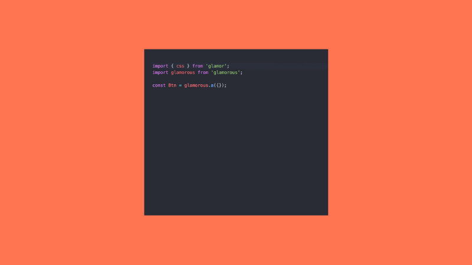

- Frontend developer specializing in all things JavaScript
- Done a bit of everything, whether that's jQuery, Angular, React, you name it
- I've also done a fair bit of everything in CSS land, whether it's vanilla CSS, LESS, SASS, CSS Modules, and (of course) the gamut of CSS in JS solutions
  

- I work at a great company called Object Partners
- Specialize in JVM and frontend development of all sorts
- About 100 consultants between here, MN, and Chicago
- Come talk to me after if you'd like to learn more (and I'll have some swag to give out too)
  

- Many of you probably have a pretty negative perception of CSS in JS
- It goes against the "separation of concerns" that has been ingrained and regularly re-enforced
- It feels weird, feels unclean, and feels like it's a solution looking for a problem
  

- My goal is to take you from that initial perception/feeling to at least understanding/slightly skeptical of the practice
- If I'm successful, maybe even a few of you will leave and want to use/experiment with some of these technologies

## Agenda

- Discussion of the problems of CSS
- Defining what CSS in JS is, and how it can solve some of these problems
- Discussing some various CSS in JS libraries, any real world examples of usage of these
- Finishing up with some discussion of drawbacks of CSS in JS and some quick demos
  

- My goal is to take you from that initial perception/feeling to at least understanding/slightly skeptical of the practice
- If I'm successful, maybe even a few of you will leave and want to use/experiment with some of these technologies

## Agenda

- Discussion of the problems of CSS
- Defining what CSS in JS is, and how it can solve some of these problems
- Discussing some various CSS in JS libraries, any real world examples of usage of these
- Finishing up with some discussion of drawbacks of CSS in JS and some quick demos
  

- This section will discuss the problems (as I see them) of CSS
- The goal is by the outset that these problems will be clear, and from this foundation we can begin to construct the argument for CSS in JS solutions
  

- We design a button component used in our application
- It looks great, works great, and meets every need we have
  

- We get a request for an alternately styled variant for one particular screen of the application
- We add some CSS and style it with a "secondary class"
  

- We get another request that the button is far too large
- We add a "tiny" class that can be added so that the button displays with a smaller font, padding, etc.
  

- We get a final request that the button needs to have a hover state that is inverted for a certain screen
  

- CSS naming methodologies like BEM exist to solve this problem!
- Also see Atomic CSS, SMACSS, Object oriented CSS, etc.
  

- Consider this code by Kent C Dodds
- Why not use tools to automate these trivial naming concerns
- This is why we use tools, to automate and make something that can be hard, easy or easier
  

- But this problem of globals has been solved
- Why should we care about CSS in JS when we have the shadow dom and/or CSS modules?
- CSS Modules is CSS in JS
- Shadow modules are going to be great, but not quite ready yet
  

- In order to work around CSS's inherent scaling issues, tools like BEM, LESS, SASS, etc. are often utilized
- CSS in JS removes this cognitive overload
- Generally when I hear "does not scale," that can be a sign that the person just doesn't like the technology; however, it's actually true here!
- The earlier example with the button is an illustration of the underlying issue
- The bigger your application gets, the more CSS you will write, which creates more globals and a harder to maintain application
  

- Anyone who's ever re-factored a large app knows that it can be incredibly difficult to re-factor "unused" CSS
- Any rule could be used in unforseen places
- Removing rules can be spooky, and you need automated testing or a person who really knows the code to validate 0 unforeseen effects
- CSS in JS gives you confidence that by removing this component/CSS, you are only removing code applicable to this component  
  

- Anyone who's developed an application before has probably ran into this problem
- We can solve this with a build process and some defined constants, but that can oftentimes be fragile and/or brittle
- Why not use one "source of truth" for all shared application constants, whether it's constants used in the HTML, CSS, or JavaScript
  

- Credit where credit is due
- Christopher Cheudeau (a developer at Facebook) illustrates these problems in a great talk a few years ago
- It's linked at the end if you want to take a look!
  

Early on in my career, I was in a meeting where I said that a solution/idea wasn't good and left it at that. Another person in the meeting said something to the effect of "If you can't bring anything to the table, then don't say anything at all." Obviously I don't agree with his sentiment, but that doesn't detract from the fact that he wasn't wrong. So now that we've illustrated some of the problems of CSS, the discussion will shift into what CSS in JS is, and how it can fix some of these aforementioned problems aka I'm trying to bring something to the table :).  
  

- I want to be *very* clear here, if you haven't seen yourself running into any of the aforementioned problems, and if you leave here unconvinced, that's fine!
- CSS as it exists will continue to exist
- It's not CSS in JS or CSS. CSS in JS uses CSS and uses what I think are the best parts of CSS (aka the rules) and avoids the worst parts (aka the nesting, globals, etc.)
  

- Maybe we can use JS to solve some of the ills of CSS
- Maybe there's actually some validity to this practice, and
- Maybe it can really improve the quality and maintainability of your styling solution to your apps/websites/etc.
- Maybe we'll see :)
  

- So Ben Lesh (sarcastically) puts into words what I think is going to be the most common reaction to CSS in JS
- It goes against everything we've been taught, and the kind of "hyper modularization" that we've been saying in the JS ecosystem lately
  

However... seperation of concerns is not the same as seperation of technologies. It is incredibly likely that the rendering of a component will require intermingling between HTML, CSS, and JavaScript, and if we can make this intermingling as clean as possible, that's a win for code clarity and maintainability, not a loss.
  

- Consider this great slide by Cristiano Rastelli
- The whole "component driven" model blurs the lines between HTML, CSS, and JavaScript because there inevitably will be shared concerns between a single component which is composed of each of these pieces
- A great illustration of this is with Vue's single file components, which a lot of people love
  

- Definition by contradiction :)
- CSS in JS is not, or not exclusively, inline styles
- CSS in JS, at its "best," leverages CSS and the power of CSS
- This means the best parts of CSS (e.g. rules, media queries, pseudo styles, etc.) still exist and are usable in this CSS in JS paradigm
- You can certainly go that route, and many libraries exist to go that route
  

- High time to actually begin talking about what CSS in JS **is**
- We'll go over some high-level goals of CSS in JS, as well as what it can do
- We'll also discuss in some detail how it can solve some of the previously mentioned problems with CSS in JS
  

- CSS abstracts style to the document level
- CSS in JS abstracts style to the component level
- CSS in JS brings CSS into the "component age"
- In a similar way that React/Angular are abstractions on JavaScript, CSS in JS abstracts upon the base model of CSS and improves it
  

- Creating a hash for the class name inherently scopes the styles
- This gives us a shadow-dom like effect today, without a polyfill
- It truly brings the component-era to CSS, and eliminates issues with CSS such as globals and dead code elimination
  

- Leveraging the full power of JS teaches CSS new ways of doing things
- Full sharing of any constants; particulaly useful for breakpoints, colors, etc.
- Injection/modification via props
  

- It takes the good parts of CSS (flexbox, styling, etc.)
- It "cures" the bad parts of CSS (globals, leaky abstractions, etc.)
- If you already know CSS, great! CSS in JS presumes that you do; use the properties/rules/etc. of CSS that you already know
  

- It brings CSS into the component age
- We've removed globals from our JavaScript, why not do the same with CSS?
- Distributable, single import components that are entirely encapsulated
  

- It uses JavaScript to write styles
- This leverages the full power of the JS ecosystem
- Easy to use, distribute, load with module bundler of choice
  

- True, unlimited semantic elements
- HTML5 gave us header, footer, section, aside, etc.
- Some of these libraries give us unlimited semantic "tags"
  

- Makes it incredibly clear what the element is doing, just via its tag
  

- Removes the need to keep a mental modal (or debug!) stacking rule priorities
- Cures the global ailment
  

- Now that we've talked about all this CSS in JS for quite some time, let's talk about some libraries to instrument this practice
  

- Most of these are tied to React
- However, some of them (or the underlying dependencies that power them) are library/framework-agnostic
- So while you may have the tendency to gloss over the ones that are all React, try to resist, because you may still be able to use techniques or practices from that ecosystem
  

- The gateway drug to CSS in JS libraries
- You use tagged template literals, which basically means you call a function with all arguments specified as an array
- You can pretty much copy and paste CSS (even nesting, although it's not recommended!) from an existing CSS architecture
  

- Glamorous built on some of the ideas, particularly the exporting of "tags" to remove the need for wrapping elements
- However, the major difference is that it expects style objects, rather than style strings
- Another difference is the general API of injecting props/calling functions, etc.
  

- Leverages ideas from both Glamorous and styled-components
- Can write styles as string or as a style object
- Has a really interesting babel plugin that compiles away the compiler at build time (think Angular AOT compilation for CSS in JS)
  

- SASS/LESS helpers for CSS in JS
- lighten/darken/rgba/etc/etc
- I've heard it described as the lodash of CSS in JS libraries, and I think that's a fair comparison
- It was originally designed for usage in styled-components, but should work in any CSS in JS lib
  

These are just the color methods, but polished contains a bunch more including:

- em/rem helpers
- radial gradient generators
- normalize.css injection
- shorthands for common things such as text-overflow ellipsis, font-face, etc.
  

- styled-components is probably the most popular, but of these, it was also the first
- glamorous requires glamor, so a lot of the glamor downloads are likely from glamorous
- aphrodite and radium were huge players (and may still be a good choice in certain scenarios), but I tend to like the others a bit more; radium is inline style based
  

- Similar story here, styled-components tends to be the most starred of each of them
- radium was a huge player prior to the introduction of the CSS injection style of libraries, which I think tend to be a bit more useful
  

- The cost of using these libraries is non-null
- However, each of them is a fairly small payload GZipped
  

- I always like seeing lists of companies using tech.
- Makes me personally feel like there's validity to the practice if these other, big companies are also using it
- Also, Twitter, Facebook, and probably others!
  

- Wanted to give each of you a feel for what it feels like actually writing code in each of these libraries
- Doing some common things like theming, using props, composing/extending components, etc.
- Note I'm not endorsing any particular library, so I tried to show each of them at their best!
- Additionally note, nearly all of these examples are React based, but the underlying ideas could likely be utilized in other frameworks/libraries
  

- Props injection can be super handy to just make a little change here or there
- For instance, a button may want to take an inverted style, or even a backgroundColor prop to change the bgColor
  

- How do we extend a component?
- You use it like a function, and the extension takes precedence over the underyling style
- styled-components has a similar API, as well as a new \`.extend\` function that exists on a styled component
  

- Just wanted to drive home that this is truly real CSS
- Most of these libraries (particularly styled-components and glamorous) inject real stylesheets with a unique class name
- This means you get the full power of CSS including media queries, pseduo styles, etc.
  

- But what about animations, particularly keyframe animations? Those are global!
- Most libraries include some type of helper to return a unique identifier for these animations so no globals are introduced!
  

If you're designing a component library and want to make it CSS in JS friendly, consider exposing the className prop

- these libraries inject a className, which would then be applied on top of the existing styles
- Note this may not work perfectly, but it's worth checking out!
- Additionally, if you are "wrapping" your styled elements, this is a great way to make those wrappers extensible, as well
  

- Libraries that require a certain class structure (e.g. Bootstrap), can also work with CSS in JS libraries!
- This example exposes a wrapped bootstrap Alert, which can then be used as a regular React component
  

- The styled-components variant
  

- Theming is a common concern (and can be kinda hard!) for CSS
- CSS in JS libraries generally expose a ThemeProvider, which then makes the theme rules & colors available to the underlying components
- Super easy to make a light/dark variant, for example
  

- I'm showing a theme object here, and then a component consuming the current theme value(s)
  

- In the interest of fairness, CSS in JS certainly has some drawbacks worth considering
  

- When JavaScript is disabled (still a concern!), how do we progressively enhance?
- This is precisely where Progressive Enhancement rears its head
- You can mitigate with statically rendering or server-side rendering (hydrating) some launch HTML, or at least using the 'noscript' tag to display some content
- 0.2% may not seem like much, but if you're Facebook scale or driving a lot of traffic it's a concern
  - 1,000,000 monthly users means 2,000 users may not be getting a usable site
  

- To get the style scoping working, a unique identifier/className is generated
- However, this takes away some of the semantic meaning when viewing the compiled version
- I'm not overly concerned about this, but it is worth mentioning
- There are some ways you can guide to generate more human readable class names, but haven't done a ton of research into that
  

- Editor tooling is still in its infancy
- Autocomplete in particular has room for improvement
  

- But it seems like every week there are new developments to get this working as seamlessly as possible
  

- As with anything, if you're directly injecting user input (even into CSS!) you open yourself up to issues
- Great article on React-Armory that just came out this week, linked to at the end
  

- This is a big question mark for me currently
- It's something I'd like to investigate for my talk in November
- In general, it seems hard to believe CSS in JS is 1:1 with CSS because of the layers of abstraction/libraries we're adding, but I'm not sure (yet!) if this performance difference is meaningful
- But stay tuned! I'll probably be posting on twitter some findings as I start investigating this
  

- So what are we to make of all of this?
- CSS in JS solves real problems of CSS
- It does so in a very clean, and developer friendly way
- Performance may be a concern, as is the reliance on JS
  

- Overall, I'm really happy with CSS in JS and what it's done for the ecosystem
- If I were to start a new project today, I'd author it using one of the CSS in JS libraries we've talked about, and I'd feel good about doing so
  

- On that note, I recently finished a project using and demonstrating (you guessed it!) CSS in JS libraries
- Let's do a quick demo
  

- One final thanks to the organizers and sponsors of this conference, and for giving me an opportunity to present at my first ever conference
- Come talk to me tonight at the after party :)
